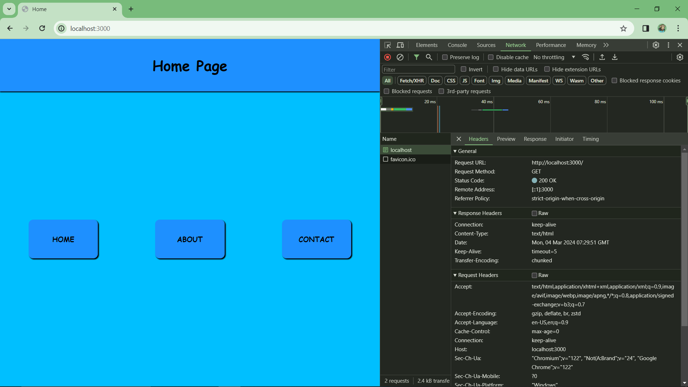
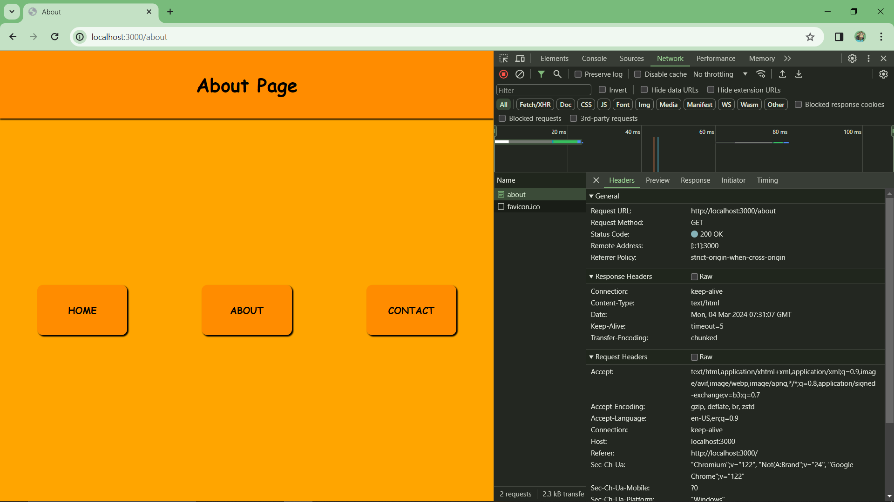
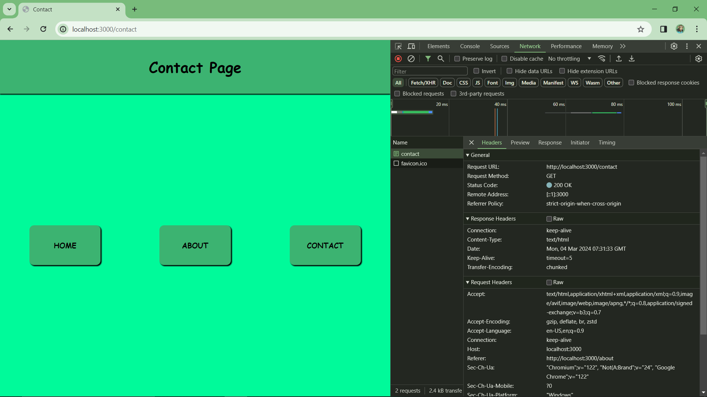
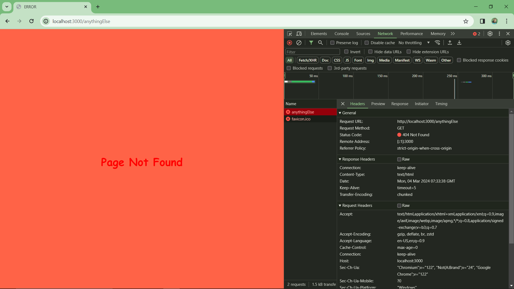
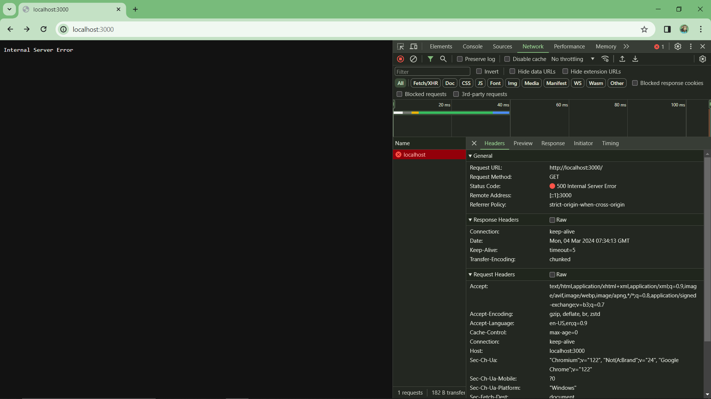

# Task 20
A basic web server that uses the Node.js http module to handle different routes and serve corresponding HTML pages.

Use "npm run dev" to start the server!!

The below screenshots are the results for different routes including invalid routes showing 404 error page and other possible server error checked by changing the page variable to something else...

